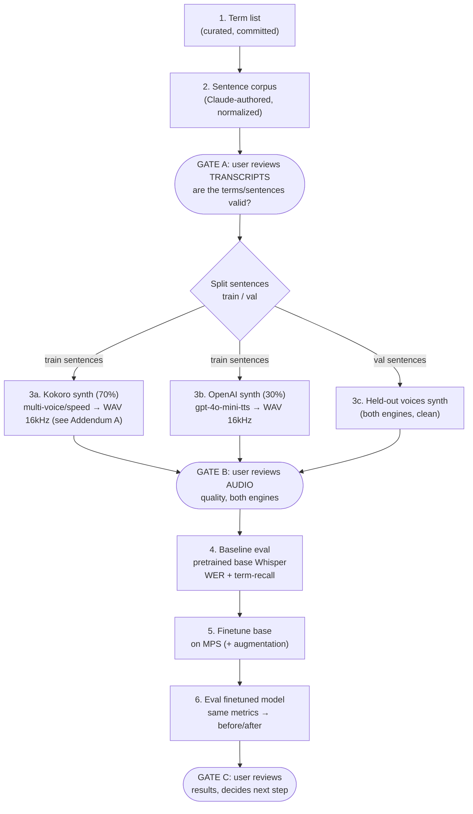

# Finetuning Whisper `base` for AI-Dev Domain Vocabulary — Design

**Status:** DRAFT COMPLETE — awaiting user review before implementation planning
**Date:** 2026-06-15
**Goal (learning-focused):** Finetune the `base` Whisper model so it reliably transcribes
2025–2026 AI-driven-software-development vocabulary (e.g. "harness engineering",
"Claude Opus", "vibe coding") that the stock model mis-hears. Primary purpose is to
learn ASR / Whisper / domain-adaptation mechanics end to end.

**Hardware:** Apple M4, 16 GB unified RAM (PyTorch MPS backend).

> **IMPLEMENTATION UPDATE (during build):** the bulk 70% TTS engine was changed from
> **Supertonic → Kokoro** after audio review showed Supertonic stochastically garbles short
> acronyms (RAG→"raggy"). Pronunciation is now controlled by a per-term **spoken-form** map,
> and per-clip QC was replaced by a **one-time per-term audit** (the QC judge can't read our
> jargon, so it false-drops good audio). Full rationale + data in **Addendum A** (end of doc).
> Where sections below say "Supertonic", read "Kokoro" unless noted.

---

## Section 1 — Pipeline overview & project structure

The project is a linear pipeline with three **review gates** (points where the user
inspects before we spend time or money).



**Three human-review gates by design:**
- **Gate A — transcripts** (user-requested): user reviews the corpus *before any audio is
  generated* — are the target terms present, correctly spelled, and used naturally? No
  synthesis happens until transcripts are approved.
- **Gate B — audio** (user-requested): after both engines finish generating, user reviews
  audio quality before any finetuning. (Note: a *small sample* is also played during build
  for a quick sanity check; Gate B is the full sign-off after generation completes.)
- **Gate C — results:** user reviews before/after numbers before any hyperparameter iteration.

**Baseline-first (step 4):** we measure the *un-finetuned* base model's WER and
term-recall before training. The learning payoff is the *delta*, so the baseline is
mandatory, not optional.

### Distribution split & the clean→real gap

**Key finding (historical, from the original Supertonic engine):** the local TTS exposed only
`voice_style`, `speed`, `total_step`, and `silence_duration`, with an un-seeded noisy latent
that gave free micro-variation between "takes" but **no parameter for background noise,
reverb, or mic coloring** — it only ever produced clean studio audio. Kokoro (the engine we
actually use) and OpenAI TTS are *also* clean studio audio. So no TTS engine closes the
clean→real gap on its own.

**Decision:** use **both engines for voice/prosody diversity** + **audio augmentation for
acoustic realism**. This makes OpenAI part of the *training* distribution (so it can no
longer serve as a cross-engine val probe); val becomes a principled speaker/sentence-
disjoint design instead.

- **Train audio:** Kokoro (multiple voices/speeds/takes) **+** OpenAI TTS (multiple
  voices), with **augmentation** (noise / reverb / SpecAugment / codec) applied on top.
- **Val tiers (held-out voices AND held-out sentences — no leakage):**
  1. **clean** → "did it learn the terms & generalize to unseen speakers/text?"
  2. **augmented** (same clips, fixed-seed augmentation) → "how robust under noise/reverb?"
     The clean-vs-augmented delta is itself a core robustness lesson.
  3. **(Optional, gold)** a handful of real self-recordings → the true reality check.

Caveat to keep honest: even the augmented val is still synthetic-derived. The real
recordings are the only true real-world signal; treat them as directional. The held-out
clean TTS set remains the precise primary tracking metric.

### Project structure

```
finetune-whisper/
  .env                      # OPENAI_API_KEY (gitignored, never printed)
  .venv/                    # project venv
  data/
    terms.yaml              # curated term list + canonical spellings
    corpus.jsonl            # Claude-authored sentences (text + which terms)
    audio/{train,val_clean,val_aug}/    # generated WAVs + per-split manifests
  src/
    build_corpus.py         # validates corpus, balances term coverage
    synth_kokoro.py         # 70% of train + half of val_clean (local, free)
    synth_openai.py         # 30% of train + half of val_clean (paid, gated)
    augment.py              # on-the-fly train aug + fixed-seed val_aug bake
    eval.py                 # WER + term-recall, runs on any model
    train.py                # the finetune loop
  kokoro_models/            # Kokoro ONNX engine + voices (gitignored)
  docs/superpowers/specs/   # this design doc
```

---

## Section 2 — Dataset spec

### 2.1 Term list (`data/terms.yaml`)

~40–60 curated terms grouped by category, each with a **canonical written form** (the exact
spelling used in every transcript and in scoring) and optional alt-spellings (forms the
stock model might emit, used only by the term-recall metric). Categories:

- **Models/products:** Claude Opus, Claude Sonnet, Claude Code, GPT-5, Codex, Cursor,
  Windsurf, Devin, Copilot, Gemini, …
- **Labs:** Anthropic, OpenAI, DeepMind, Mistral, xAI
- **Concepts/jargon:** vibe coding, harness engineering, context engineering, agentic
  coding, subagents, tool calling, RAG, MCP / Model Context Protocol, evals, fine-tuning,
  LoRA, RLHF, chain of thought, test-time compute, guardrails, system prompt,
  hallucination, embeddings, …
- **Tools/frameworks:** LangChain, LlamaIndex, Hugging Face, vLLM, Ollama, Whisper

### 2.2 Normalization rules (the WER-critical part)

A single canonical spelling per term, applied identically everywhere. Draft decisions:

| Spoken | Canonical transcript | Notes |
|---|---|---|
| "M-C-P" / "model context protocol" | `MCP` | acronym kept uppercase |
| "rag" | `RAG` | acronym |
| "claude opus" | `Claude Opus` | product cased |
| "gpt five" | `GPT-5` | hyphen + digit |
| "vibe coding" | `vibe coding` | lowercase common-noun phrase |
| "lora" | `LoRA` | stylized caps |

WER scoring uses Whisper's `EnglishTextNormalizer` **plus** our term canonicalizer so the
model is judged on the right surface form. The same normalizer is applied to training
targets, so train/eval are consistent.

### 2.3 Sentence corpus (`data/corpus.jsonl`)

Claude-authored, ~980 natural conversational software-dev sentences (~900 train / ~80 val;
see 2.7). Each line:
`{id, text, terms:[...], split:"train"|"val"}`. Constraints:
- 6–25 words; varied length and phrasing; sometimes multiple terms per sentence.
- **Balanced coverage:** every term appears in ≥ N sentences (target N≈8) across varied
  contexts; `build_corpus.py` validates coverage and fails if any term is under-covered.

### 2.4 Splits (two disjoint axes)

- **Sentence-disjoint (text):** ~900 train / ~80 val sentences. Term coverage maintained in
  both, so val terms are seen-in-training-text-but-in-new-sentences (tests text
  generalization, not memorization).
- **Speaker-disjoint (voice):** reserve held-out voices used **only** in val — e.g. 2
  Kokoro + 2 OpenAI voices held out; the rest are train-only.

### 2.5 Synthesis

All audio resampled to **16 kHz mono WAV** (Whisper's required input). Per-split manifest
`{audio_path, text, terms, engine, voice, speed}`.

- **Train (~6,000 clips) — engine ratio fixed at 7:3 Kokoro:OpenAI** (≈4,200 / 1,800):
  - *Kokoro (70%):* train voices (`af_*`/`am_*`) × speeds {0.95, 1.0, 1.1} × multiple
    takes. Free + local, so it carries the bulk of the volume.
  - *OpenAI (30%):* `gpt-4o-mini-tts`, train-voice subset, request WAV/PCM → resample to
    16 kHz. Capped at 30% both for the ratio and to keep paid usage modest.
  - Renditions per sentence are allocated to hit the 7:3 split exactly (see `synth_*`).
- **Val clean (~160 clips):** held-out sentences × held-out voices, both engines (val ratio
  need not match 7:3 — coverage matters more than ratio here).

### 2.6 Augmentation (`audiomentations` / `torchaudio`)

The acoustic-realism lever. **Train:** applied **on-the-fly** per sample (prob ≈ 0.6; some
clips stay clean) — random chain of: `AddBackgroundNoise` (small noise set) or file-free
`AddColoredNoise`, `RoomSimulator`/`ApplyImpulseResponse` (reverb), `Gain`,
`Mp3Compression`, mild `SevenBandParametricEQ`. **SpecAugment** (time/freq masking) applied
on the log-mel inside the training collator — the same trick used in Whisper's own
pretraining. **Val augmented tier:** identical chain but **fixed seed**, baked once, so the
robustness metric is stable across runs.

Noise source (small, to stay laptop-friendly): default to file-free `AddColoredNoise` for
zero-dependency start; optionally add **ESC-50** (~600 MB, CC) for realistic ambient noise.

### 2.7 Sizes & OpenAI cost

| Asset | Count |
|---|---|
| Corpus sentences | ~980 (~900 train / ~80 val) |
| Train clips | **~6,000** (7:3 Kokoro:OpenAI ≈ 4,200 / 1,800) |
| Val clean clips | ~160 |
| Val augmented clips | ~160 (derived, fixed-seed) |
| Real recordings (optional) | ~15–30 |

**Sizing rationale:** ~900 hand-authored train sentences × ~6–7 renditions (voices ×
speeds × takes × engines) → ~6k clips, a "considerable" set for `base` while staying
laptop-feasible. Augmentation multiplies effective diversity further on-the-fly.

**OpenAI cost:** ~1,800 train + a few val OpenAI clips ≈ ~130k chars → low single-digit
dollars. The only paid item; exact clip/char count + estimate shown **before** any paid
run (the in-build small sample is sanity-checked first; Gate B is the full sign-off, and
the full paid run is confirmed separately before it executes).

**Training-time note (M4 MPS):** ~6k clips at batch 8 ≈ ~750 steps/epoch; a few epochs ≈
**1–3 h** wall-clock on the M4. Larger sets scale linearly — easy to subset for faster
iteration, or grow if you want.

## Section 3 — Training spec

### 3.1 Model & approach

- **Model:** `openai/whisper-base.en` (74M, English-only). The English-only checkpoint
  gives lower English WER than the multilingual `whisper-base` for an all-English domain,
  and removes language-token handling we don't need. (Multilingual `whisper-base` is the
  drop-in alternative if we ever go multilingual.)
- **Stack:** HuggingFace `transformers` `WhisperForConditionalGeneration` +
  `WhisperProcessor`, trained with `Seq2SeqTrainer` / `Seq2SeqTrainingArguments` — the
  canonical, well-tested Whisper finetuning recipe (a from-scratch loop is a possible
  later learning variant).
- **Full finetune, not LoRA.** At 74M params, a full finetune fits comfortably in 16 GB
  and is the cleaner thing to *learn from*. LoRA/PEFT is noted as an optional follow-up
  experiment to compare parameter-efficient vs full adaptation.

### 3.2 Data path (per sample)

`manifest → load WAV (16 kHz mono) → [train only] audiomentations augment on waveform →
WhisperFeatureExtractor (80-ch log-mel) → [train only] SpecAugment masking → input_features`;
target = `normalize(text) → tokenizer → labels`. Padding via
`DataCollatorSpeechSeq2SeqWithPadding` (labels padded with -100).

- **Augmentation lives in the train dataset's `__getitem__`** (random per epoch). Val
  datasets are clean; the augmented-val tier uses a separate fixed-seed pass.
- **SpecAugment** (time/freq masking) applied to log-mel in the collator — Whisper's own
  pretraining trick; off for eval.

### 3.3 Hyperparameters (starting point)

| Param | Value | Why |
|---|---|---|
| learning_rate | 1e-5 | standard for Whisper finetune; small to avoid forgetting |
| warmup_steps | ~200 | stabilize early training |
| batch size | 8 (+ grad-accum to eff. 16–32) | fits `base` in 16 GB on MPS |
| epochs / max_steps | ~4 epochs (~3k steps) | ~6k clips ÷ batch 8 ≈ 750 steps/epoch |
| precision | **fp32** | MPS fp16 is unstable; bf16 partial. fp32 = correctness over speed |
| gradient_checkpointing | optional | extra memory headroom if needed |
| eval_strategy | epoch | matches save_strategy; track WER on val-clean **and** val-aug per epoch |
| save_strategy / save_total_limit | epoch / None | **keep every epoch's checkpoint** (user decision) |
| metric_for_best_model | val-clean WER | flag best; lower is better (best flagged, none pruned) |
| predict_with_generate | true | WER needs generated text, not just loss |

### 3.4 Framework choice — MPS for training, MLX optional for inference

Apple-Silicon-native acceleration is a goal. The two options:

- **PyTorch MPS (chosen for training).** `mps` is PyTorch's Metal backend — unified memory,
  no CPU↔GPU copies, the native Apple-Silicon accelerator. The entire finetuning recipe
  (`Seq2SeqTrainer`, `datasets`, `audiomentations`, `jiwer`) is PyTorch-native and works on
  MPS out of the box.
- **MLX (not used for training; optional for inference).** Apple's MLX is often *faster*
  than MPS on raw ops, but `mlx-whisper` targets **inference/transcription**, not
  finetuning. Training in MLX would mean hand-writing the loop and abandoning the proven HF
  data/augmentation/eval tooling — wrong trade for a learning project favoring correctness.
  **Optional follow-up:** convert the finished model with `mlx-whisper` for fast local
  inference. Out of scope for the training phase.

### 3.5 MPS specifics

- `device="mps"`; set `PYTORCH_ENABLE_MPS_FALLBACK=1` so any unsupported op silently
  falls back to CPU instead of crashing.
- fp32 throughout; expect slower than CUDA (the 1–3 h estimate already accounts for this).
- Watch unified-memory pressure; if OOM, drop batch to 4 + raise grad-accum, and/or enable
  gradient checkpointing.

### 3.6 Checkpointing & generation config

- Force English transcribe (`language="en", task="transcribe"`) in generation config so the
  model never tries to translate.
- **Save *every* checkpoint, not just the best** (user decision): `save_strategy="epoch"`
  (a checkpoint per epoch) with **`save_total_limit=None`** so nothing is pruned. Since we
  train only a few epochs, keeping all of them lets us inspect the WER/term-recall
  trajectory per epoch and pick/compare any of them at Gate C.
- Still record which checkpoint is best-by-val-clean-WER (via `load_best_model_at_end` +
  `metric_for_best_model`) for convenience, but all per-epoch checkpoints are retained in
  `checkpoints/`.

## Section 4 — Evaluation spec

### 4.1 Metrics

1. **WER** (primary, on val-clean) — computed with Whisper's `EnglishTextNormalizer` **plus**
   our term canonicalizer, via `jiwer`. The headline before/after number.
2. **Term recall** (the instructive one) — for every occurrence of a target term in the
   reference, did the hypothesis contain its canonical form? Reported **per-term** and
   aggregate. Overall WER can dilute domain gains; term recall isolates "did it actually
   learn the vocabulary." Includes a qualitative dump of term errors
   (e.g. `Claude Opus → cloud opus`) for insight.

### 4.2 Eval sets (run on every model)

- **val-clean** (held-out voices + sentences) — primary tracking set.
- **val-aug** (fixed-seed augmented) — robustness; report the **clean-vs-aug WER delta**.
- **real recordings** (optional) — directional real-world signal only.

### 4.3 Baseline-first & reporting

- `eval.py` takes any model (HF id or checkpoint path), so the **same code** produces the
  pretrained-baseline numbers and the finetuned numbers.
- Run order: baseline `whisper-base.en` → finetune → finetuned model → **before/after
  table** (WER + term recall per set). This delta is the whole learning payoff and is what
  the user reviews at **Gate C**.

## Section 5 — Environment & dependencies

### 5.1 Python env

- **Project venv at `.venv/`** (all Python runs go through it — never bare `python3`).
- Start from system Python 3.13; if any dependency lacks 3.13 wheels, fall back to a 3.11
  venv (pinned in the plan).

### 5.2 Dependencies

- **Training/ASR:** `torch`, `torchaudio` (macOS arm64 wheels ship MPS), `transformers`,
  `datasets`, `accelerate`, `evaluate`, `jiwer`.
- **Audio/augmentation:** `audiomentations`, `soundfile`, `librosa`, `numpy`.
- **TTS engines:** `kokoro-onnx` + `onnxruntime` + system `espeak-ng` (Kokoro bulk engine),
  `openai` + `python-dotenv` (OpenAI TTS). `audiomentations` extras: `pyroomacoustics`
  (reverb), `fast_mp3_augment` (MP3 codec).
- **Misc:** `pyyaml`, `rapidfuzz` (QC fuzzy match). Pinned in `requirements.txt`.

### 5.3 Kokoro assets (bulk engine)

Kokoro ONNX model + voices are downloaded to `kokoro_models/` (gitignored):
`kokoro-v1.0.onnx` (~325 MB) + `voices-v1.0.bin` (~28 MB) from the kokoro-onnx release.
Requires system **`espeak-ng`** (`brew install espeak-ng`) for phonemization; scripts set
`PHONEMIZER_ESPEAK_LIBRARY` to the Homebrew dylib. (The original Supertonic clone and its
weights were removed from the project once Kokoro was settled on.)

### 5.4 Reproducibility & gitignore

- Set training seed; note Kokoro is deterministic per (voice, speed, text), while OpenAI TTS
  is non-deterministic — so audio isn't fully bit-reproducible by design, but manifests
  record exactly what was generated.
- `.gitignore`: `.env`, `.venv/`, `data/audio/`, `checkpoints/`, `kokoro_models/`.

### 5.5 Testing strategy

- **Data test:** `build_corpus.py` fails if any term is under-covered (< target N) — the
  corpus can't pass Gate A in a broken state.
- **Synthesis smoke test:** generate a few clips per engine; assert WAV is 16 kHz mono and
  non-silent (RMS > threshold).
- **Eval self-check:** `eval.py` on a tiny fixture before full runs.
- **Interactive CLI testing:** every script is run manually on small inputs before scaling
  (per project rules — no claiming coverage without an actual run).

---

## Open items / explicitly out of scope

- Real-recording val tier is **optional**, added only if the user wants the final reality
  check after seeing synthetic results.
- LoRA / parameter-efficient comparison: out of scope (full finetune only), possible follow-up.
- Multilingual support: out of scope (English-only `base.en`).

---

## Addendum A — TTS engine evolution (Supertonic → Kokoro) & pronunciation control

**Why we switched.** Audio review of the first samples showed Supertonic stochastically
garbles short acronyms: the same voice+sentence renders "RAG" as /ræɡ/ on one take and
"raggy"/"ragged" on another (its latent is un-seeded). A back-transcription QC filter
(transcribe each clip with `whisper-small.en`, regenerate on garble) only lifted the clean
yield from **82% → 85%** — regeneration barely helped because the failures are *systematic*
(e.g. "evals" failed 6/9 times), not random. So Supertonic's term quality was not viably
improvable.

**Kokoro head-to-head.** Same 60-sentence QC test: Kokoro reached **90% pass@1** and fixed
RAG/xAI. A per-term audit (50 terms × 6 voices) found **42/50 terms clean on every voice**.

**Pronunciation control (engine-agnostic).** The deeper issue: "correct" pronunciation is
term-specific — RAG/LoRA are spoken as *words*, but MCP/RLHF/GPT-5 are *initialisms* spelled
out — and TTS guesses from casing. We added a per-term **`spoken`** field in `terms.yaml`
(e.g. `RAG → "rag"`, `LoRA → "lora"`, `Ollama → "Oh-lama"`); `normalize.to_spoken()` builds
the TTS input from spoken forms while the **transcript stays canonical**. Most acronyms are
genuine initialisms and are left unchanged.

**QC strategy (final).** Per-clip QC is OFF for generation. Its judge (`whisper-small.en`)
cannot read our domain jargon — the exact terms we finetune for — so it false-drops *good*
audio (e.g. it hears "Alama" for a correct "Ollama"). Because Kokoro is **deterministic**,
correctness is instead established once by the **per-term audit** + human ear-check, with
genuine mispronunciations fixed via `spoken`. The QC module (`src/qc.py`) is retained — it
was the right tool for stochastic Supertonic and documents the investigation.

**Net effect on the spec:** "Supertonic (70%)" → "Kokoro (70%)" everywhere; `synth_kokoro.py`
replaces `synth_supertonic.py` as the bulk engine; voices are Kokoro `af_*/am_*`; assets live
in `kokoro_models/` (`kokoro-v1.0.onnx` + `voices-v1.0.bin`, needs system `espeak-ng`). The
7:3 ratio, two-axis disjoint split, augmentation, training, and eval design are unchanged.
